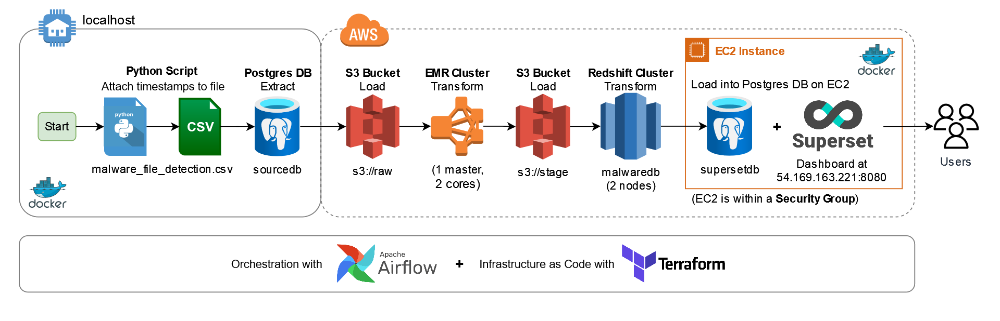
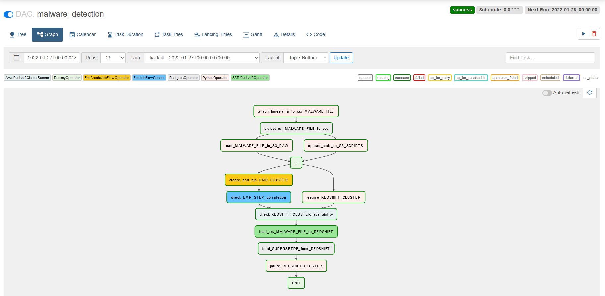
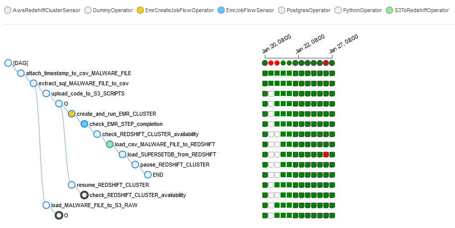
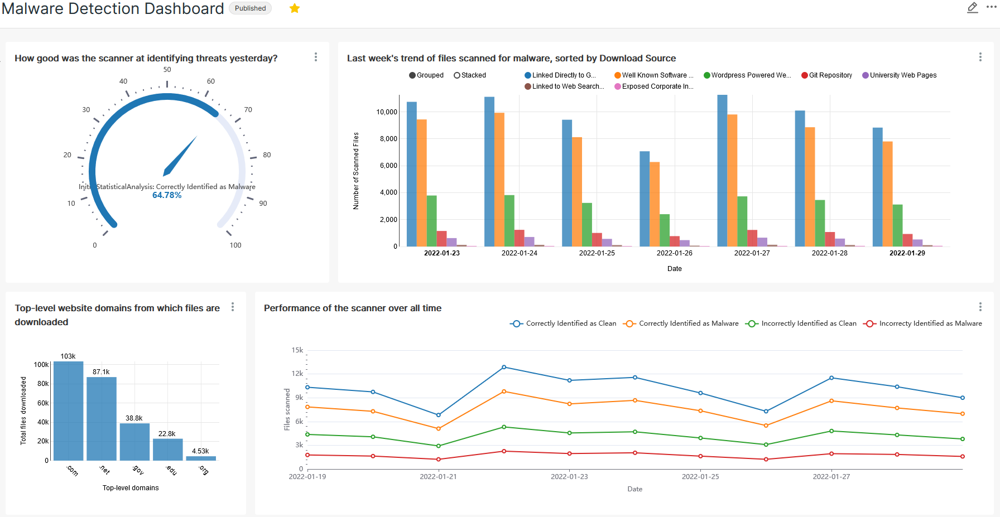

# AWS Batch Data Processing Pipeline

```sh
.
├── dags
│   ├── malware_detection.py
│   ├── scripts
│   │   ├── emr
│   │   │   └── create_emr.json
│   │   ├── spark
│   │   │   └── malware_file_detection.py
│   │   └── sql
│   │       ├── extract_malware_files.sql
│   │       └── from_redshift_to_supersetdb.sql
│   └── utils.py
├── database-setup
│   ├── redshiftdwh.sql
│   ├── sourcedb.sql
│   └── supersetdb.sql
├── source-data
│   ├── temp
│   │   ├── .gitkeep
│   │   └── malware_files_sample.csv
│   ├── .gitkeep
│   ├── dated_sample.csv
│   ├── malware_detection.csv
│   └── sample.csv
├── terraform
│   ├── main.tf
│   ├── superset_ec2_keypair.pem
│   ├── terraform.tfstate
│   ├── terraform.tfvars
│   └── variables.tf
├── .dockerignore
├── .gitattributes
├── .gitignore
├── README.md
├── docker-compose.yml
├── .env
└── requirements.txt
```

In this project, I built a data pipeline on AWS that performs daily batch processing. The final Terraform task spins up an
EC2 instance on which a Postgres database and Superset dashboard are hosted. Public users can login via one of the
usernames (and passwords) `public1`, `public2`, or `public3`, and explore the data or create their own dashboards.



Initially, the dataset that I used did not have a time column, so I wrote a Python function
that generates timestamps for the following week, every week, on Mondays. The file contains `N = 165053` rows,
and I wanted to divide it up into 7 days. However, I don't want
each day to have the same number of rows, so the timestamps were generated in a random fashion, drawing
from a Gaussian distribution with mean `N/7` and standard deviation `N/70`. In this way, some days might
have more rows than other days, e.g. 21st January had 16069 rows while 20th January had 22735 rows, and this
is different for every week as well. The other columns in the dataset represent the attributes of each file
that was "downloaded" and "scanned" whether or not the file contains malicious software. Information about each
column is detailed in the `metadata.csv` file in the `source-data` folder.

Next, I want to pretend that the data source for the AWS pipeline comes from a SQL database, so
the CSV file is loaded into a local Postgres instance hosted on a Docker container. The Airflow framework
that orchestrates all of this is also hosted on its on set of containers. After this, I use Terraform to
provision each of the AWS infrastructure as I need according to the data pipeline figure above. Terraform
is an Infrastructure as Code tool and uses declarative programming. This means I tell Terraform exactly
how I want my cloud infrastructure to look like and it will create it for me that way. From here onwards,
I test my data pipeline by triggering runs on Airflow, and if it goes well, I schedule it to run daily at
midnight UTC. In fact, the pipeline is already running properly everyday, and only breaks when my Internet
Service Provider (ISP) changes my local IP address (which looks like it happens on Thursdays).





It takes at least 5-8 minutes to start up and stop an EMR cluster (also known as a "cold start" in cloud computing) even though
it only takes about 30-60 seconds to process the data. Similarly, the Redshift cluster also requires several minutes to resume/pause
from a paused/resumed state, but only several seconds to store the file from S3 and copy it over to `supersetdb` in the EC2 instance.
In addition, EMR and Redshift are massive, heavy-duty beasts that were made for tackling terabytes and petabytes of
big data. Using them to process and store a small 25 MB dataset is super overkill.

Hence, an alternative architecture could involve replacing EMR with a Lambda function, and removing the Redshift component altogether.
This way, the entire pipeline can stay online, and can easily process small data (perhaps up to 1 GB?) within a couple of minutes
instead of ~20 minutes for a full DAG run. The only cold start would be the Lambda function, which is practically negligible. The cost would also be
very low, and only include storage costs on S3 and hosting Docker containers on EC2 (even this can be free for 12 months if using
the free-tier `t2.micro` instance).

Finally, here is a simple dashboard I built using the data from `supersetdb` (not the data from Redshift). Public users can
access this dashboard, but cannot alter the visuals and cannot perform DML (Data Manipulation Language) operations on the Postgres
database. Public users are also invited to create their own charts/dashboard and explore the data using the SQL editor.



**Git commit labels:**

- :rocket: Initial commits.
- :gear: Maintenance, rewriting some parts of code, small code changes.
- :beetle: Fixing bugs in the code, which cause errors or unintended behavior.
- :arrow_up: Enhancements to the functionality of existing code.
- :star: New features, such as adding a new AWS service or a new container.
- :books: Code documentation, README edits and adding images/media.
